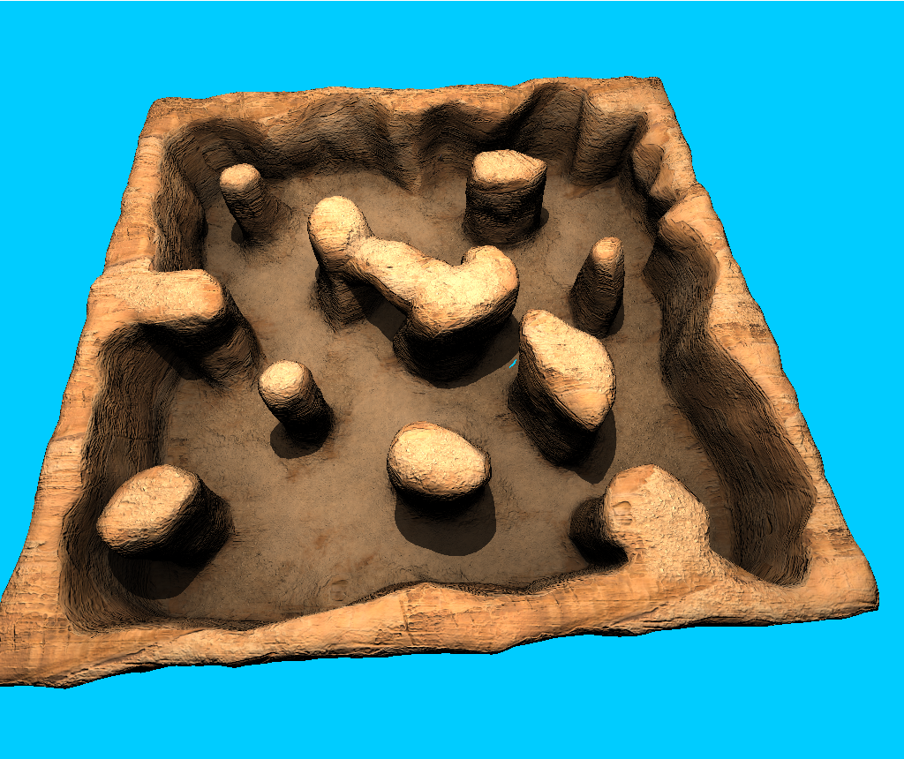
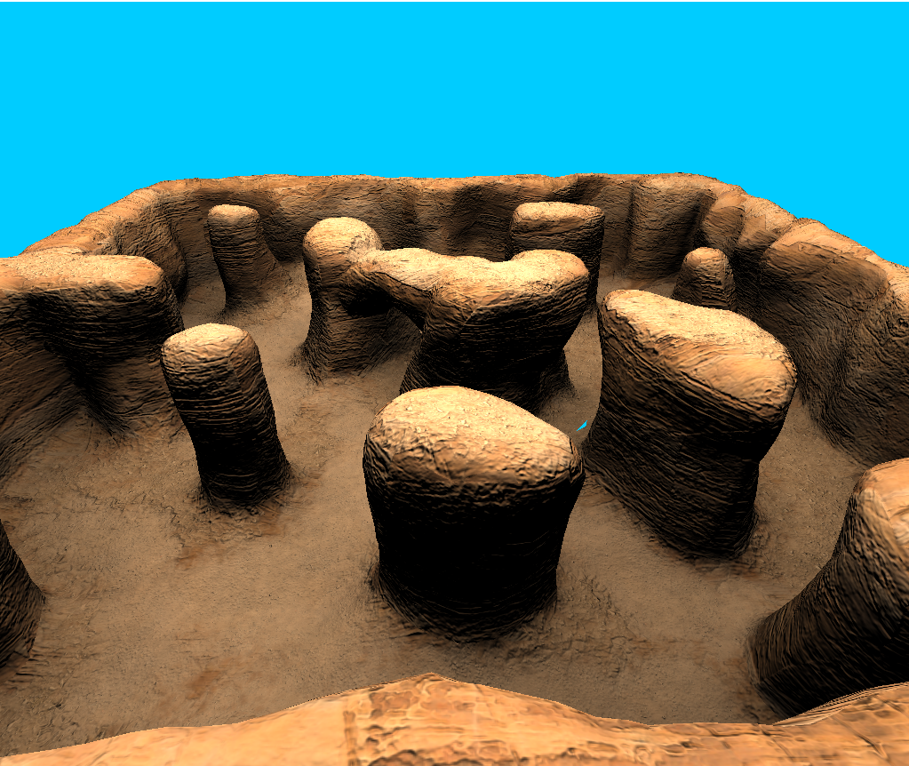
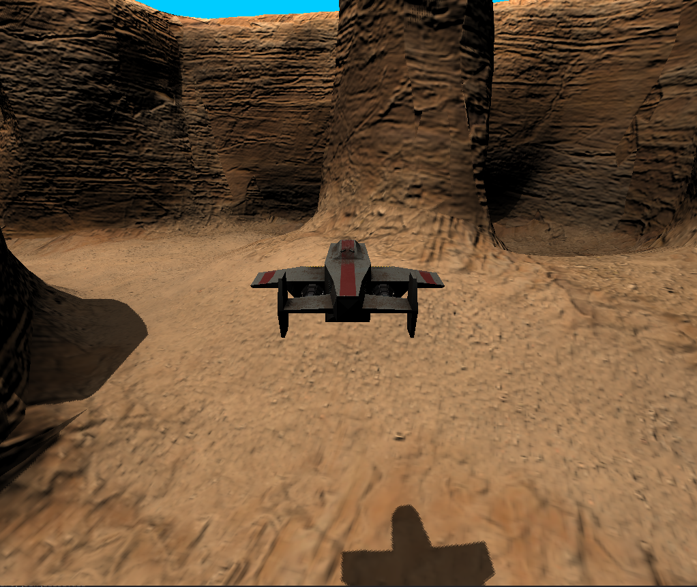

# TatooineSpaceBalls
#### University Project for CG made using OpenGL

->Simply Execute the .sln file as the Assets are already uploaded in the repo

### Members

* Petros Chanas 3170173
* Konstantinos Vasilopoulos 3180018

### Introduction

##### Terrain with the Shadows

##### Terrain without the Shadows

####Shadow of the Craft

##### Terrain with the Shadows

The goal of this assignment is create a simple game using OpenGL. The project's code is based on similar lab code. 

### Requirements

The assignment requires the implementation of the following features:

* Load the terrain and the craft using their .obj files.
* Use albedo and normal mask maps.
* Allow the craft to navigate freely around the map.
* Create andposition a camera behind the craft.
* Implement at least one light source.
* Implement a physically correct light model, such as normalized Blinn-Phong or Cook-Torrance.
* Detect collisions between objects.

### Data

The following files where provided:

* Craft (obj, mtl, normal map, base map, mask map)
* Terrain (obj, mtl, normal map, base map, mask map, light map)
* Hull (obj, mtl, normal map, base map, mask map)
* Canopus background (png, bmp)

### Craft movement

The player can move the craft around using his **WASD** keys. **A** and **D** will rotate the craft left and right respectively, while **W**, **S** will increase and decrease the craft's angle of attack.

#### Freelook mode

By pressing **SPACEBAR** the user can enter *freelook mode*. In freelook mode the camera will detach itself from the craft. Additionally, the **A** and **W** keys' function will also change. Instead of altering the craft's AoA, the aforementioned keys will now move the camera forwards and backwards. Finally, the user will be able to change the camera's orientation by clicking and dragging his mouse. By pressing the **SPACEBAR** key again, the user can revert back to normal mode.

#### Boosting

The user can increase the craft's speed by pressing and holding the **LSHIFT** key.

### Scene lighting

For the scene's lighting, a spot light was used. The spot light is placed at an angle, overlooking the scene's terrain. The light's RGB coordinates are (255, 255, 241), which emulate that of the sun. In order to give a realistic feel to the illumination of the ground, the spot light's penumbra was completely removed.

### Scene Shading

For the scene's shading a Cook-Torrance Shading Algorithm was used.
The Basic Formula for the algorithm is the following 

### Shadow Maps

### Deferred Rendering

We used Deferred Rendering and Shading for the project
and depth of field feature was also used.

### Bloom Effect and DoF Effect

In the project the usage of bloom effect and the visualization of the depth field buffer were used as an extension of the deferred rendering procedural concept. The Depth Of Field component applies a depth of field effect, which simulates the focus properties of a camera lens. In real life, a camera can only focus sharply on an object at a specific distance; objects nearer or farther from the camera are out of focus. The blurring gives a visual cue about an object’s distance, and introduces Bokeh, which refers to visual artifacts that appear around bright areas of the image as they fall out of focus. Bloom is a post-processing effect used to reproduce an imaging artifact of real-world cameras. The effect produces fringes (or feathers) of light extending from the borders of bright areas in an image, contributing to the illusion of an extremely bright light overwhelming the camera capturing the scene.

### Gaussian Blur

In the post-processing chapter's blur we took the average of all surrounding pixels of an image. While it does give us an easy blur, it doesn't give the best results. A Gaussian blur is based on the Gaussian curve which is commonly described as a bell-shaped curve giving high values close to its center that gradually wear off over distance. The Gaussian curve can be mathematically represented in different forms, but generally has the following shape.
As the Gaussian curve has a larger area close to its center, using its values as weights to blur an image give more natural results as samples close by have a higher precedence. If we for instance sample a 32x32 box around a fragment, we use progressively smaller weights the larger the distance to the fragment; this gives a better and more realistic blur which is known as a Gaussian blur.

To implement a Gaussian blur filter we'd need a two-dimensional box of weights that we can obtain from a 2 dimensional Gaussian curve equation. The problem with this approach however is that it quickly becomes extremely heavy on performance. Take a blur kernel of 32 by 32 for example, this would require us to sample a texture a total of 1024 times for each fragment!

Luckily for us, the Gaussian equation has a very neat property that allows us to separate the two-dimensional equation into two smaller one-dimensional equations: one that describes the horizontal weights and the other that describes the vertical weights. We'd then first do a horizontal blur with the horizontal weights on the scene texture, and then on the resulting texture do a vertical blur. Due to this property the results are exactly the same, but this time saving us an incredible amount of performance as we'd now only have to do 32 + 32 samples compared to 1024! This is known as two-pass Gaussian blur.
