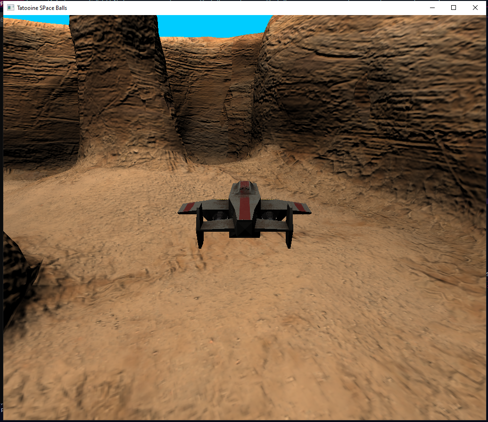

# TatooineSpaceBalls
#### University Project for CG made using OpenGL

->Simply Execute the .sln file as the Assets are already uploaded in the repo

### Members

* Petros Chanas 3170173
* Konstantinos Vasilopoulos 3180018

### Introduction

The goal of this assignment is create a simple game using OpenGL. The project's code is based on similar lab code. 

### Requirements

The assignment requires the implementation of the following features:

* Load the terrain and the craft using their .obj files.
* Use albedo and normal mask maps.
* Allow the craft to navigate freely around the map.
* Create andposition a camera behind the craft.
* Implement at least one light source.
* Implement a physically correct light model, such as normalized Blinn-Phong or Cook-Torrance.
* Detect collisions between objects.

### Data

The following files where provided:

* Craft (obj, mtl, normal map, base map, mask map)
* Terrain (obj, mtl, normal map, base map, mask map, light map)
* Hull (obj, mtl, normal map, base map, mask map)
* Canopus background (png, bmp)

### Craft movement

The player can move the craft around using his **WASD** keys. **A** and **D** will rotate the craft left and right respectively, while **W**, **S** will increase and decrease the craft's angle of attack.

#### Freelook mode

By pressing **SPACEBAR** the user can enter *freelook mode*. In freelook mode the camera will detach itself from the craft. Additionally, the **A** and **W** keys' function will also change. Instead of altering the craft's AoA, the aforementioned keys will now move the camera forwards and backwards. Finally, the user will be able to change the camera's orientation by clicking and dragging his mouse. By pressing the **SPACEBAR** key again, the user can revert back to normal mode.

#### Boosting

The user can increase the craft's speed by pressing and holding the **LSHIFT** key.

### Scene lighting

For the scene's lighting, a spot light was used. The spot light is placed at an angle, overlooking the scene's terrain. The light's RGB coordinates are (255, 255, 241), which emulate that of the sun. In order to give a realistic feel to the illumination of the ground, the spot light's penumbra was completely removed.
